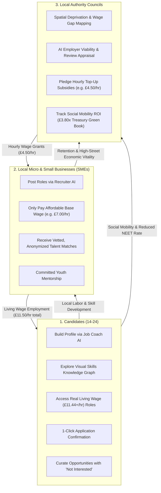

# Springboard UK — Technical Architecture & System Design

Springboard is a multi-sided economic platform designed to eliminate youth unemployment and underemployment across the United Kingdom. It unifies **candidates (aged 14–24)**, **local micro and small businesses (SMEs)**, and **UK Local Authorities (Councils)** through conversation-first AI agents, transparent deterministic matching algorithms, an interactive visual skills knowledge graph, and a geospatial wage subsidy co-funding engine.

---

## 1. High-Level System Architecture

```
┌──────────────────────────────────────────────────────────────────────────────────────────────────┐
│                                   CLIENT LAYER (Browser / Mobile)                                │
│                                                                                                  │
│   ┌──────────────────────────────────────────────────┐  ┌────────────────────────────────────┐   │
│   │             apps/web (Port 3000 / Vercel)        │  │     apps/council (Port 5174)       │   │
│   │   React 18 • TypeScript • Vite • Tailwind CSS    │  │   React 18 • TypeScript • Vite     │   │
│   │   • Candidate Portal (/coach, /matches, /profile)│  │   • Council Policy Director Chat   │   │
│   │   • Skills Knowledge Graph (/knowledge via XYFlow│  │   • Leaflet Geospatial Map Engine  │   │
│   │   • Business Recruiter AI (/business/assistant)  │  │   • IMD Deprivation Layers         │   │
│   │   • Council Subsidy Map & AI Appraisal Engine    │  │   • Schemes & Allocations Ledger   │   │
│   │   • Theme Engine (Light Mode / Dark Mode)        │  └─────────────────┬──────────────────┘   │
│   └─────────────────────────┬────────────────────────┘                    │                      │
└─────────────────────────────┼─────────────────────────────────────────────┼──────────────────────┘
                              │                                             │
                              └──────────────────────┬──────────────────────┘
                                                     │ JSON / REST API (Bearer JWT)
                              ┌──────────────────────▼──────────────────────┐
                              │     Vercel ASGI Gateway (api/index.py)       │
                              │     Mounts FastAPI at /api and root /        │
                              └──────────────────────┬──────────────────────┘
                                                     │
                              ┌──────────────────────▼──────────────────────┐
                              │          services/api (Port 8000)           │
                              │ Python 3.12+ • FastAPI • Pydantic 2 • SQLA 2│
                              ├─────────────────────────────────────────────┤
                              │ Routers:                                    │
                              │ • /auth (Argon2 hash, stateless JWT)        │
                              │ • /profiles (Candidate profile & skills)    │
                              │ • /businesses (SME profile & wage gap)      │
                              │ • /opportunities (Listings, pay, workplace) │
                              │ • /applications (Tracking, submission)      │
                              │ • /matches (Deterministic 0–100 scoring)    │
                              │ • /conversations (Multi-turn agent chat)    │
                              │ • /councils (Map data, schemes, allocations)│
                              ├─────────────────────────────────────────────┤
                              │ Agent Layer (Dual-Mode Orchestration):      │
                              │ • YouthAgent • BusinessAgent • CouncilAgent │
                              │ • Allow-listed ToolExecutor (Pydantic v2)   │
                              │ • PendingAction Gatekeeper (Human-in-loop)  │
                              │ • Gemini API Function Calling + Rule Mode   │
                              ├─────────────────────────────────────────────┤
                              │ Services & Engines:                         │
                              │ • MatchingEngine (Deterministic 0-100 fit)  │
                              │ • KnowledgeGraphService (Skill clustering)  │
                              │ • WageSubsidyService (Ledger & refunds)     │
                              │ • Geocoding & Haversine Distance Calculator │
                              └──────────────────────┬──────────────────────┘
                                                     │ SQLAlchemy 2 ORM
                              ┌──────────────────────▼──────────────────────┐
                              │         PostgreSQL 16 + PostGIS 3.4          │
                              │ (Automatic fallback to SQLite standalone     │
                              │  springboard.db for zero-config deployment) │
                              └─────────────────────────────────────────────┘
```

---

## 2. The Three-Sided Economic Marketplace

Springboard is engineered around a tripartite economic feedback loop:



---

## 3. Frontend Architecture

The frontend architecture consists of the main application (`apps/web`), the dedicated council dashboard (`apps/council`), and the shared domain package (`packages/shared-types`).

### A. Main Web Portal (`apps/web` on Port 3000)

- **Framework**: React 18, Vite, TypeScript, Tailwind CSS, React Router 6, `@xyflow/react` (React Flow), Leaflet, Lucide Icons.
- **Portals**:
  1. **Candidate Portal** (`/coach`, `/matches`, `/applications`, `/profile`, `/knowledge`):
     - **Job Coach AI (`/coach`)**: Multi-turn conversational onboarding, automated skill extraction, and vacancy discovery with human-in-the-loop action cards.
     - **Match Matrix (`/matches`)**: Deterministic match score breakdown. Includes an interactive **"Not Interested"** button on opportunity cards that permanently dismisses unwanted roles and prevents future recommendations.
     - **My Applications (`/applications`)**: Real-time status tracking for submitted applications. Zero-state guides candidates directly to their personalized Match Matrix.
     - **Skills Knowledge Graph (`/knowledge`)**: Node-edge interactive graph rendered via `@xyflow/react`, showing existing skills, connected opportunities, and expandable "frontier skills".
  2. **Business Portal** (`/business/assistant`, `/business/opportunities`, `/business/profile`):
     - **Recruiter Assistant AI (`/business/assistant`)**: Conversational vacancy drafting, automatic wage gap identification, and privacy-safe candidate discovery.
     - **Vacancy Management**: Real-time tracking of candidate applicants and match scores.
  3. **Council Experience** (`/council`, `/council/map`, `/council/advisor`):
     - **Geospatial Wage Subsidy Map (`/council/map`)**: High-performance OpenStreetMap integration (zero external API keys required). Displays Buckinghamshire wards with sector-categorized business markers (Tech, Health, Manufacturing, Retail, Creative, Green, Community).
     - **AI Subsidy Scoring & Ranking**: Clicking any business marker inspects the employer directly in the side panel—displaying AI viability ratings, past apprentice reviews, and funding recommendations without obscuring map cartography.
     - **Reset View Control**: Convenient reset button in the header top-right aligned with the ward filter.

### B. Dual-Theme Engine (Light Mode & Dark Mode)

- **State Management**: Provided by [**`ThemeContext.tsx`**](file:///c:/Users/green/OneDrive/Desktop/Springboard/apps/web/src/context/ThemeContext.tsx), exposing `theme` (`'dark' | 'light'`), `toggleTheme()`, and `isDark`.
- **Storage & Detection**: Automatically persists preference in `localStorage` (`'springboard_theme'`) with fallback to browser `prefers-color-scheme`.
- **CSS Strategy**:
  - `tailwind.config.js` sets `darkMode: "class"`.
  - Toggling adds/removes `class="light"` on `document.documentElement` and synchronizes the browser `color-scheme` property.
  - Comprehensive scoped rules in `apps/web/src/index.css` under `html.light` map dark slate backgrounds (`bg-slate-950` -> `#f8fafc`, `bg-slate-900` -> `#ffffff`), borders (`border-slate-800` -> `#e2e8f0`), typography (`text-white` -> `#0f172a`), inputs, selects, badges, and Leaflet tooltips.
  - Smooth 0.2s color and background transition on `<html>` eliminates harsh visual flashes.

### C. Monorepo TypeScript Path Resolution

- To avoid cyclic compilation bottlenecks and allow development without pre-compiled declaration files, `apps/web/tsconfig.json` and `apps/council/tsconfig.json` map domain types directly to source:
  ```json
  "paths": {
    "@/*": ["./src/*"],
    "@springboard/shared-types": ["../../packages/shared-types/src/index.ts"]
  }
  ```
- This guarantees `tsc --noEmit` and Vite build execute reliably in clean CI and Vercel environments where `packages/shared-types/dist` is not checked into version control.

---

## 4. Backend Architecture (`services/api`)

Built with **Python 3.12+**, **FastAPI**, **SQLAlchemy 2**, and **Pydantic v2**.

### A. Dual-Mode Agent Orchestrator Engine

```
                  ┌───────────────────────────────┐
                  │      User Chat Message        │
                  └───────────────┬───────────────┘
                                  │
                                  ▼
                    Is GEMINI_API_KEY Configured?
                                 / \
                                /   \
                        Yes   /       \   No (or API timeout)
                             /         \
                            ▼           ▼
             ┌─────────────────────┐  ┌─────────────────────┐
             │ Gemini 3.x API      │  │ Deterministic Rule  │
             │ Native Tool Calling │  │ Intent Router       │
             └──────────┬──────────┘  └──────────┬──────────┘
                        │                        │
                        └───────────┬────────────┘
                                    │
                                    ▼
                     Allow-Listed ToolExecutor
                     (Typed Pydantic v2 Validation)
                                    │
                         Is it a Write Action?
                                 / \
                                /   \
                        Yes   /       \   No (Read-Only)
                             /         \
                            ▼           ▼
               Create PendingAction      Execute Database Read
               Render UI Card            Return Direct Response
               Wait for User Confirm
```

1. **Live Gemini Mode**: When `GEMINI_API_KEY` is present, connects via `google-genai` using typed function calling.
2. **Offline Rule Mode**: Zero-cost fallback executing the identical allow-listed tools, guaranteeing reliable local development and 100% test suite reproducibility.
3. **Strict Sandboxing**: The agent has no raw database access; every operation is dispatched through typed Pydantic endpoints that validate permissions and resource ownership.

### B. The `PendingAction` Gatekeeper (Human-in-the-Loop)

Any mutation (saving a profile, posting a job, submitting an application, committing council funds) creates a `PendingAction` record (24–72h TTL) and returns an interactive UI card. The mutation is committed only when the human clicks "Confirm".

---

## 5. Deterministic Matching Engine

Springboard avoids black-box scoring by calculating an explainable 0–100 compatibility score:

$$\text{Total Score} = S_{\text{type}} (25\%) + S_{\text{skills}} (35\%) + S_{\text{location}} (25\%) + S_{\text{avail}} (10\%) + S_{\text{qual}} (5\%)$$

### Factor Breakdown:

1. **Opportunity Type Fit ($S_{\text{type}}$, Max 25 pts)**: Alignment with candidate's stated preference (`part_time_job`, `work_experience`, `volunteering`).
2. **Skills Overlap ($S_{\text{skills}}$, Max 35 pts)**:
   $$\text{Score} = \left(\frac{\text{Matched Required}}{\text{Total Required}} \times 25\right) + \left(\frac{\text{Matched Preferred}}{\text{Total Preferred}} \times 10\right)$$
3. **Geodesic Travel Radius ($S_{\text{location}}$, Max 25 pts)**: Haversine distance calculation scaled against candidate's maximum travel radius.
4. **Availability ($S_{\text{avail}}$, Max 10 pts)**: Overlap between candidate availability and vacancy shift requirements.
5. **Accredited Qualifications ($S_{\text{qual}}$, Max 5 pts)**: GCSE, BTEC, or A-Level attainment bonus.

### Candidate Dismissal Logic ("Not Interested"):

When a candidate marks an opportunity as "Not Interested", the recommendation engine permanently suppresses the vacancy from future suggestion sets and adjusts candidate sector weights accordingly.

---

## 6. Wage Subsidy Co-Funding Engine

### The Problem: Minimum Wage Affordability Gap

Micro and small businesses operating on thin margins cannot afford the UK Real Living Wage (£11.44/hr) for junior entry-level roles.

### The Subsidy Mechanism

1. **Employer Affordable Base Wage**: e.g., £7.00/hr.
2. **Target UK Real Living Wage**: £11.44/hr.
3. **Hourly Wage Gap**: $£11.44 - £7.00 = £4.44/\text{hr}$.
4. **Council Hourly Grant**: e.g., £4.50/hr top-up.
5. **Combined Youth Wage**: $£7.00 + £4.50 = £11.50/\text{hr}$ (Exceeds Real Living Wage).

### Grant Commitment Formula

$$\text{Total Grant Allocation} = \text{Hourly Subsidy Rate} \times \text{Max Hours/Week} \times \text{Duration in Weeks}$$
_Example: £4.50/hr × 16 hrs/wk × 24 weeks = **£1,728.00 ring-fenced grant commitment**._

### Invariant State Machine

- **Allocation Creation (`POST /councils/allocations`)**: Atomically decrements scheme budget, increments council spent total, transitions business status to `"active_subsidised"`.
- **Allocation Cancellation (`PATCH /councils/allocations/{id}`)**: Atomically refunds unspent commitment back to the scheme budget and restores business eligibility.

---

## 7. Geospatial & Deprivation Intelligence

- **Coordinate System**: WGS84 (EPSG:4326).
- **Spatial Storage**: PostGIS `geometry(Point, 4326)` in PostgreSQL, with automatic mathematical Haversine fallback in SQLite.
- **OpenStreetMap Cartography**: Standardized on OpenStreetMap tile servers for reliable zero-key deployment.
- **IMD Deprivation Integration**: Maps UK Index of Multiple Deprivation deciles (Deciles 1–3) with low-income family percentages. Businesses operating in high-deprivation wards receive an elevated priority score for council funding.

---

## 8. Vercel Serverless Full-Stack Architecture

To enable seamless full-stack deployment on Vercel without multi-container overhead:

1. **`vercel.json`**:
   - `buildCommand`: `pnpm --filter @springboard/shared-types build && pnpm --filter @springboard/web build`.
   - `outputDirectory`: `apps/web/dist`.
   - Rewrites route `/api`, `/api/(.*)`, `/docs`, `/openapi.json`, and `/health` to `/api/index.py`, and all other paths to `/index.html`.
2. **`api/index.py` ASGI Gateway**:
   - Dynamically adds `services/api` to `sys.path`.
   - Mounts the FastAPI application at both `/api` and `/` so all endpoints resolve seamlessly whether request paths preserve or strip the `/api` prefix.
3. **Database Portability**:
   - Operates against hosted PostgreSQL via `DATABASE_URL`, or automatically initializes standalone SQLite (`springboard.db`) if no remote database is configured.

---

## 9. Security, Safeguarding & ICO Compliance

1. **Authentication**: Argon2 password hashing + HMAC-SHA256 stateless JWT (7-day TTL).
2. **Role-Based Access Control**: Strict FastAPI dependencies (`require_role("youth")`, `require_role("business")`, `require_role("council")`).
3. **GDPR Data Minimization**: Employer candidate searches return anonymized summaries only (first name, distance, skills). Contact details and private addresses are never revealed without explicit candidate application consent.
