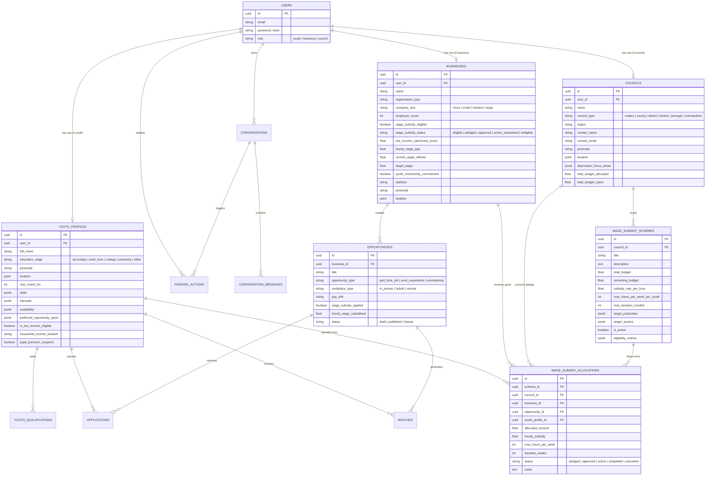

# Springboard UK MVP — Architecture & Technical Design

## 1. System Overview

Springboard is a multi-sided economic and opportunity platform dedicated to unlocking part-time work, work experience placements, and volunteering opportunities for young people across the UK. It bridges youth candidates, local businesses, and **UK Local Councils** through interactive AI agents, transparent deterministic matching algorithms, and a spatial wage subsidy platform.

```
┌─────────────────────────────────┐       ┌─────────────────────────────────┐
│     React 18 SPA (apps/web)     │       │   Council Portal (apps/council) │
│     Port 5173 • Youth & SME     │       │   Port 5174 • Local Councils    │
│  AgentChat • Knowledge • Forms  │       │  Geospatial Map • Wage Grants   │
└────────────────┬────────────────┘       └────────────────┬────────────────┘
                 │                                         │
                 └────────────────────┬────────────────────┘
                                      │ JSON / REST (Bearer JWT)
                 ┌────────────────────▼────────────────────┐
                 │       FastAPI Backend (services/api)    │
                 │ Routers: Auth, Profiles, Businesses,    │
                 │          Opportunities, Apps, Matches,  │
                 │          Conversations, Councils        │
                 │ Agents: YouthAgent, BusinessAgent,      │
                 │         ToolExecutor, Policy Advisor    │
                 │ Services: Matching, Geocoding, Subsidy  │
                 └────────────────────┬────────────────────┘
                                      │ SQLAlchemy 2 ORM
                 ┌────────────────────▼────────────────────┐
                 │       PostgreSQL 16 + PostGIS 3.4       │
                 │  Spatial Geo-points • Geodesic Radius   │
                 │  (Auto-fallback to SQLite in standalone)│
                 └─────────────────────────────────────────┘
```

---

## 2. Core Domain Data Model



---

## 3. Wage Subsidy Co-Funding Mechanics

### The SME Affordability Gap
Small and micro businesses (cafés, independent shops, repair workshops, digital studios) often operate on narrow margins and struggle to afford the UK National Living Wage (£11.44/hr). Without co-funding, they cannot create formal youth jobs or take on 16–18 year olds from low-income backgrounds.

### Council Top-up Formula
- **Company Affordable Base Wage**: e.g., £7.00/hr
- **Target Real Living Wage**: £11.44/hr
- **Hourly Wage Gap**: £4.44/hr
- **Council Subsidy Grant**: £4.50/hr top-up
- **Youth Total Earnings**: £11.50/hr (Exceeds Real Living Wage)

### Grant Commitment Formula
$$\text{Total Grant Allocation} = \text{Hourly Subsidy} \times \text{Hours/Week} \times \text{Duration (Weeks)}$$
*Example: £4.50/hr × 16 hrs/wk × 24 weeks = **£1,728.00 total ring-fenced grant commitment**.*

### State Machine & Budget Invariants
1. **Creation (`POST /councils/allocations`)**:
   - Deducts `allocated_amount` from `WageSubsidyScheme.remaining_budget`.
   - Increments `Council.total_budget_spent`.
   - Sets `Business.wage_subsidy_status = "active_subsidised"`.
   - Sets allocation `status = "active"`.
2. **Cancellation (`PATCH /councils/allocations/{id}` with `status = "cancelled"`)**:
   - Refunds `allocated_amount` back to `WageSubsidyScheme.remaining_budget`.
   - Decrements `Council.total_budget_spent`.
   - If no other active subsidies exist, resets `Business.wage_subsidy_status = "eligible"`.

---

## 4. Geospatial & Deprivation Catchment Intelligence

### Spatial Projection
Both `Council` and `Business` records store exact WGS84 coordinates (`latitude`, `longitude`) and PostGIS Geometry points.
- On **PostgreSQL**: uses `ST_SetSRID(ST_MakePoint(lon, lat), 4326)`.
- On **SQLite**: uses Haversine geodesic calculations.

### Deprivation Overlay
The Council platform incorporates UK **Index of Multiple Deprivation (IMD)** ward boundaries with youth population estimates and low-income family percentages (e.g. Chesham Waterside, High Wycombe Central). Councils can filter businesses that overlap these priority youth catchments.
