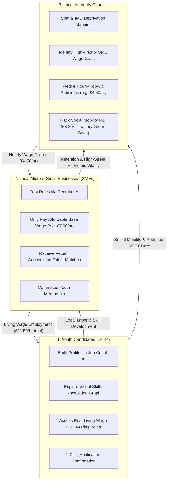
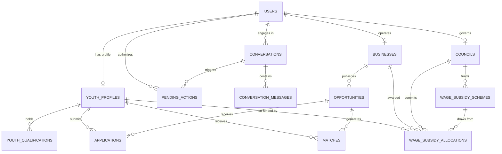

# Springboard UK — Technical Architecture & System Design

Springboard is a multi-sided economic platform designed to eliminate youth unemployment and underemployment across the United Kingdom. It unifies **young people (aged 14–24)**, **local micro and small businesses (SMEs)**, and **UK Local Authorities (Councils)** through conversation-first AI agents, transparent deterministic matching algorithms, an interactive visual skills knowledge graph, and a geospatial wage subsidy co-funding engine.

---

## 1. High-Level System Architecture

```
┌────────────────────────────────────────────────────────┐   ┌────────────────────────────────────────────────────────┐
│             apps/web (Port 5173)                       │   │             apps/council (Port 5174)                   │
│   React 18 • TypeScript • Vite • Tailwind CSS          │   │   React 18 • TypeScript • Vite • Tailwind CSS          │
│   • Youth Job Coach AI (/coach)                        │   │   • Council AI Policy Director Chat (Command Center)   │
│   • Skills & Knowledge Graph (/knowledge via XYFlow)   │   │   • Leaflet & CartoDB Geospatial Map Engine            │
│   • Recruiter Assistant AI (/business/assistant)       │   │   • IMD Deprivation Catchment Layer                    │
│   • Application Tracker & Opportunity Management       │   │   • Wage Subsidy Schemes & Allocations Ledger          │
└───────────────────────────┬────────────────────────────┘   └───────────────────────────┬────────────────────────────┘
                            │                                                            │
                            └─────────────────────────────┬──────────────────────────────┘
                                                          │ JSON / REST API (Bearer JWT)
                            ┌─────────────────────────────▼──────────────────────────────┐
                            │               services/api (Port 8000)                     │
                            │      Python 3.12+ • FastAPI • Pydantic v2 • SQLAlchemy 2   │
                            ├────────────────────────────────────────────────────────────┤
                            │  Routers:                                                  │
                            │  • /auth (Argon2 hash, stateless JWT)                      │
                            │  • /profiles (Youth profile & qualifications)              │
                            │  • /businesses (SME profile & wage gap metrics)            │
                            │  • /opportunities (Listings, pay, workplace arrangement)   │
                            │  • /applications (Tracking, submission workflow)           │
                            │  • /matches (Deterministic 0–100 scoring & factor explain) │
                            │  • /conversations (Multi-turn agent chat & actions)        │
                            │  • /councils (Map data, schemes, allocations, analytics)   │
                            ├────────────────────────────────────────────────────────────┤
                            │  Agent Layer (Dual-Mode Orchestration):                    │
                            │  • YouthAgent • BusinessAgent • CouncilAgent               │
                            │  • Allow-listed ToolExecutor (Pydantic validated)          │
                            │  • PendingAction Confirmation Gatekeeper (Human-in-the-loop)│
                            │  • Gemini API Function Calling + Offline Rule Fallback     │
                            ├────────────────────────────────────────────────────────────┤
                            │  Services & Engines:                                       │
                            │  • MatchingEngine (Deterministic 0-100 compatibility)      │
                            │  • KnowledgeGraphService (Semantic skill clustering)       │
                            │  • WageSubsidyService (Budget deduction & refund ledger)   │
                            │  • Geocoding & Haversine Distance Calculator               │
                            └─────────────────────────────┬──────────────────────────────┘
                                                          │ SQLAlchemy 2 ORM
                            ┌─────────────────────────────▼──────────────────────────────┐
                            │                PostgreSQL 16 + PostGIS 3.4                 │
                            │      (With automatic zero-config SQLite standalone fallback│
                            │       for local development and offline unit tests)        │
                            └────────────────────────────────────────────────────────────┘
```

---

## 2. The Three-Sided Economic Marketplace

Springboard is engineered around a tripartite economic feedback loop:



---

## 3. Frontend Architecture

The frontend is partitioned into two specialized Single Page Applications (SPAs) within a `pnpm` monorepo:

### A. Main Web Portal (`apps/web` on Port 5173)
- **Framework**: React 18, Vite, TypeScript, Tailwind CSS, React Router 6, `@xyflow/react` (React Flow), Lucide Icons.
- **Audience**: Young People (14–24) and Local Businesses/Employers.
- **Key Modules**:
  - **Job Coach AI (`/coach`)**: Multi-turn conversational onboarding, automated profile extraction, and opportunity discovery.
  - **Interactive Skills Knowledge Graph (`/knowledge`)**: Node-edge interactive graph rendered via `@xyflow/react`, showing existing skills, connected opportunities, and expandable "frontier skills".
  - **Recruiter Assistant AI (`/business/assistant`)**: Conversational vacancy drafting, automatic wage gap identification, and privacy-safe candidate discovery.
  - **Opportunity Hub & Application Tracker (`/applications`)**: Deterministic match score explanations, real-time application status tracking.

### B. Council Wage Subsidy Command Center (`apps/council` on Port 5174)
- **Framework**: React 18, Vite, TypeScript, Tailwind CSS, React Router 6, Leaflet, Lucide Icons.
- **Audience**: Local Council Leaders, Economic Development Directors, and Regeneration Officers.
- **Key Modules**:
  - **Executive Command Center (`/`)**: Split-screen workflow with an interactive Geospatial Map on the left and the **Council AI Policy Director** on the right.
  - **High-Fidelity Geospatial Map (`/map`)**: OpenStreetMap & CartoDB tile layers (Dark Matter / Positron Light), Index of Multiple Deprivation (IMD) decile overlays, custom pulsating pins, and an evaluation drawer.
  - **SME Directory (`/companies`)**: Filterable roster of local employers categorized by company size, hourly wage gap, and deprivation catchment score.
  - **Subsidy Schemes (`/schemes`)**: Ring-fenced funding pool creator with target postcodes, industry sectors, and hourly subsidy caps.
  - **Allocations Ledger (`/allocations`)**: Audit log of all committed wage grants with instant status transitions (Active, Completed, Cancelled with refund).
  - **Social ROI Analytics (`/analytics`)**: Treasury Green Book-aligned £3.80x multiplier calculations, hours co-funded, and youth retention rates.

### C. Shared Domain Types (`packages/shared-types`)
- Compiled TypeScript library imported by both frontends and aligned with backend Pydantic schemas.
- Exports contracts for `User`, `YouthProfile`, `Business`, `Opportunity`, `Application`, `Match`, `Council`, `WageSubsidyScheme`, `WageSubsidyAllocation`, and `CouncilMapData`.

---

## 4. Backend Architecture (`services/api`)

The backend is built with **Python 3.12+**, **FastAPI**, **SQLAlchemy 2**, and **Pydantic v2**.

### A. Dual-Mode Agent Orchestrator Engine
To guarantee zero-cost local prototyping, seamless automated CI testing, and production LLM capabilities, Springboard features a **dual-mode agent architecture**:

```
                  ┌───────────────────────────────┐
                  │      User Chat Message        │
                  └───────────────┬───────────────┘
                                  │
                                  ▼
                    Is GEMINI_API_KEY Configured?
                                 / \
                                /   \
                        Yes   /       \   No (or API timeout)
                             /         \
                            ▼           ▼
             ┌─────────────────────┐  ┌─────────────────────┐
             │ Gemini 3.x API      │  │ Deterministic Rule  │
             │ Native Tool Calling │  │ Intent Router       │
             └──────────┬──────────┘  └──────────┬──────────┘
                        │                        │
                        └───────────┬────────────┘
                                    │
                                    ▼
                     Allow-Listed ToolExecutor
                     (Typed Pydantic v2 Validation)
                                    │
                         Is it a Write Action?
                                 / \
                                /   \
                        Yes   /       \   No (Read-Only)
                             /         \
                            ▼           ▼
               Create PendingAction      Execute Database Read
               Render UI Card            Return Direct Response
               Wait for User Confirm
```

1. **Live Gemini Mode**: When `GEMINI_API_KEY` is provided, Springboard connects to Google Gemini via the official `google-genai` SDK using native function calling with allow-listed tool declarations.
2. **Offline Rule Mode**: When running without an API key (or during network outage/rate limits), the platform automatically falls back to an offline rule orchestrator (`YouthAgentOrchestrator`, `BusinessAgentOrchestrator`, `CouncilAgentOrchestrator`) that executes the **exact same typed tools** and generates identical interactive UI cards.
3. **No Direct Database Access**: The LLM *never* has SQL access or execution privileges. It can only call typed Python functions that enforce role boundaries and resource ownership.

### B. The `PendingAction` Gatekeeper (Strict Human-in-the-Loop)
Any action that alters database state (saving a profile, publishing a job, submitting an application, or committing a council wage grant) **cannot be executed autonomously by the AI**.
- The agent calls a tool that writes a `PendingAction` record (status `pending`, with a 24h to 72h TTL).
- The chat interface renders an interactive **UI Card** (e.g., `SubsidyOfferCard`, `ConfirmationCard`, `OpportunityDraftCard`).
- The action is only executed when the human user clicks **"Confirm"** or explicitly messages confirmation.

---

## 5. Deterministic Matching Engine

Unlike black-box LLM matching, Springboard implements an explainable, deterministic 0–100 compatibility scoring algorithm in `app/services/matching_service.py`:

$$\text{Total Score} = S_{\text{type}} (25\%) + S_{\text{skills}} (35\%) + S_{\text{location}} (25\%) + S_{\text{avail}} (10\%) + S_{\text{qual}} (5\%)$$

### Factor Breakdown:
1. **Opportunity Type Fit ($S_{\text{type}}$, Max 25 pts)**:
   - 25 pts: Target opportunity type is in candidate's preferred list (`part_time_job`, `work_experience`, `volunteering`).
   - 15 pts: Candidate has no preference stated (neutral flexibility).
   - 5 pts: Partial cross-exposure.
2. **Skills Overlap ($S_{\text{skills}}$, Max 35 pts)**:
   - Required skills (25 pts): $\frac{\text{Matched Required Skills}}{\text{Total Required Skills}} \times 25.0$
   - Preferred skills (10 pts): $\frac{\text{Matched Preferred Skills}}{\text{Total Preferred Skills}} \times 10.0$ (or 10 pts if none requested).
3. **Geodesic Location & Travel Radius ($S_{\text{location}}$, Max 25 pts)**:
   - Remote positions: 25 pts.
   - In-person: Exact Haversine distance ($d$) computed between candidate coordinates and opportunity coordinates.
     $$\text{If } d \le \text{MaxTravelKm}: \quad S_{\text{location}} = \max\left(5.0, \; 25.0 \times \left(1.0 - \frac{d}{1.2 \times \text{MaxTravelKm}}\right)\right)$$
     $$\text{If } d > \text{MaxTravelKm}: \quad S_{\text{location}} = 0.0$$
4. **Schedule Availability ($S_{\text{avail}}$, Max 10 pts)**:
   - 10 pts: Candidate's available days (`Saturday`, `Sunday`, `Wednesday`) overlap with the employer's shift commitment.
   - 8 pts: Moderate/flexible default.
5. **Qualification Bonus ($S_{\text{qual}}$, Max 5 pts)**:
   - 5 pts if candidate has achieved accredited GCSE, BTEC, or A-Level qualifications.

Every calculated match stores this full factor breakdown in JSON, enabling the AI Job Coach to explain *exactly* why an opportunity was recommended.

---

## 6. Wage Subsidy Co-Funding Engine

### The Problem: The Minimum Wage Affordability Gap
Micro and small businesses (cafés, retail shops, creative studios, trades) often operate on thin operating margins and cannot afford the UK National Living Wage (£11.44/hr) for entry-level youth roles.

### The Subsidy Mechanism
1. **Employer Affordable Base Wage**: What the SME can sustainably pay (e.g. £7.00/hr).
2. **Target UK Real Living Wage**: £11.44/hr.
3. **Hourly Wage Gap**: $\text{Gap} = \text{Target Wage} - \text{Base Wage} = £11.44 - £7.00 = £4.44/\text{hr}$.
4. **Council Hourly Grant**: Council commits an hourly top-up (e.g. £4.50/hr).
5. **Combined Youth Wage**: $\text{Total} = £7.00 + £4.50 = £11.50/\text{hr}$ (Exceeds Real Living Wage).

### Grant Commitment Formula
$$\text{Total Grant Allocation} = \text{Hourly Subsidy Rate} \times \text{Max Hours/Week} \times \text{Duration in Weeks}$$
*Example: £4.50/hr × 16 hrs/wk × 24 weeks = **£1,728.00 ring-fenced grant commitment**.*

### Invariant State Machine
- **Allocation Creation (`POST /councils/allocations`)**:
  - Atomically decrements `WageSubsidyScheme.remaining_budget`.
  - Atomically increments `Council.total_budget_spent`.
  - Transitions `Business.wage_subsidy_status` to `"active_subsidised"`.
  - Sets allocation `status = "active"`.
- **Allocation Cancellation (`PATCH /councils/allocations/{id}`)**:
  - Atomically refunds `allocated_amount` back to `WageSubsidyScheme.remaining_budget`.
  - Atomically decrements `Council.total_budget_spent`.
  - If no other active allocations remain for that employer, resets status to `"eligible"`.

---

## 7. Geospatial & Deprivation Catchment Intelligence

Springboard integrates spatial data using **WGS84 coordinates (EPSG:4326)** and **Index of Multiple Deprivation (IMD)** ward boundaries.

- **PostgreSQL / PostGIS**: Coordinates are indexed using spatial geo-points: `ST_SetSRID(ST_MakePoint(longitude, latitude), 4326)`.
- **SQLite Fallback**: Mathematical Haversine formula implemented in Python for cross-platform zero-config standalone mode.
- **IMD Priority Catchments**: Incorporates ward boundaries (Deciles 1–3) with low-income family percentages (e.g., Chesham Waterside: 38.5% low-income, Decile 2; High Wycombe Central: 44.2% low-income, Decile 1). Businesses located in or near these wards receive an elevated `low_income_catchment_score` (up to 100/100).

---

## 8. Core Domain Entity Relationship Diagram



---

## 9. Security, Privacy & UK Safeguarding Standards

1. **Password Security**: Passwords hashed using Argon2 (`ph = PasswordHasher()`). Cleartext passwords are never stored or logged.
2. **Stateless JWT Authentication**: HMAC-SHA256 signed tokens with 7-day expiration.
3. **Role-Based Access Control (RBAC)**: Enforced via FastAPI dependencies (`require_role("youth")`, `require_role("business")`, `require_role("council")`).
4. **Safeguarding & GDPR Compliance**:
   - Employer search tools (`search_candidates_for_my_opportunity`) return **anonymized summaries only** (first name, general travel distance, education stage, skills).
   - Private home addresses, phone numbers, and emails are strictly withheld.
   - Age is never used to rank candidates.
   - Special category personal data (health, race, religion) is strictly prohibited from collection.
