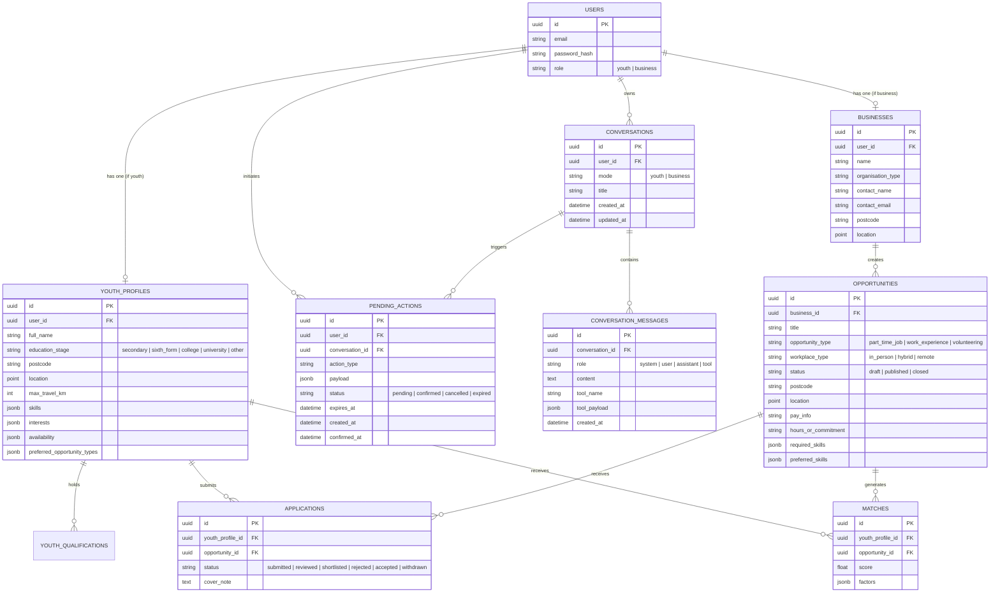

# Springboard UK MVP — Architecture & Technical Design

## 1. System Overview

Springboard is a conversation-first web platform dedicated to unlocking part-time work, work experience placements, and volunteering opportunities for young people across the UK. It bridges youth candidates and local businesses through interactive AI agents, transparent deterministic matching algorithms, and streamlined application workflows.

```
┌─────────────────────────────────────────────────────────────┐
│                   React 18 SPA (apps/web)                   │
│   Tailwind CSS • React Router 6 • Context (Auth & Toast)   │
│   Features: AgentChat • UI Cards • Form Review Fallbacks    │
└──────────────────────────────┬──────────────────────────────┘
                               │ JSON / REST (Bearer JWT)
┌──────────────────────────────▼──────────────────────────────┐
│                  FastAPI Backend (services/api)              │
│  Routers: Auth • Profiles • Businesses • Opps • Apps • Convs│
│  Agents: YouthAgent • BusinessAgent • ToolExecutor • Gemini │
│  Services: MatchingEngine (0-100) • Geocoding • Time / TTL  │
└──────────────────────────────┬──────────────────────────────┘
                               │ SQLAlchemy 2 ORM
┌──────────────────────────────▼──────────────────────────────┐
│                PostgreSQL 16 + PostGIS 3.4                  │
│       Spatial Geo-points • Geodesic Distance Calculations   │
│       (Auto-fallback to SQLite in zero-config standalone)   │
└─────────────────────────────────────────────────────────────┘
```

---

## 2. Core Domain Data Model



---

## 3. Conversation-First Agent Architecture

### Core Principle: The LLM is an Orchestrator, Not the Source of Truth

1. **No Direct Database Access**: The LLM (Gemini API with typed function-calling) never executes raw queries or has arbitrary database access. All data interactions occur strictly via allow-listed, Pydantic-validated FastAPI tools.
2. **Deterministic Matching Authority**: Match scores are computed exclusively by the platform's deterministic matching engine ($0–100\%$). The agent only interprets filters and translates stored factor breakdowns into human-readable bullet points.
3. **Explicit Confirmation Gatekeeper**: No write action (updating profiles, drafting/publishing vacancies, submitting applications) modifies database state directly from chat without generating a `PendingAction` record and requiring explicit user confirmation.

### Allow-Listed Tool Catalog

| Tool Name | Role | Type | Purpose & Safety Constraint |
| :--- | :--- | :--- | :--- |
| `get_my_youth_profile` | Youth | Read | Returns current user's profile and skills. |
| `propose_youth_profile_update` | Youth | Write Proposal | Validates patch, creates `pending_actions` record, outputs `ConfirmationCard`. |
| `search_published_opportunities` | Youth | Read | Queries published opportunities by keyword, type, workplace, location. |
| `get_my_recommended_opportunities`| Youth | Read | Retrieves deterministic match rankings for authenticated youth. |
| `get_opportunity_details` | Youth | Read | Fetches full public details of a published listing. |
| `explain_opportunity_match` | Youth | Read | Explains match score points ($S_{\text{type}}, S_{\text{skills}}, S_{\text{location}}, S_{\text{avail}}$). |
| `create_application_draft` | Youth | Write Proposal | Validates listing is open, creates `pending_actions` proposal for submission. |
| `get_my_business_profile` | Business | Read | Returns organisation profile and contact info. |
| `propose_business_profile_update` | Business | Write Proposal | Proposes organisation detail updates. |
| `propose_opportunity` | Business | Write Proposal | Validates vacancy draft, generates preview card + confirmation card. |
| `list_my_opportunities` | Business | Read | Lists opportunities owned by authenticated employer. |
| `get_my_opportunity_details` | Business | Read | Returns owned opportunity details and applicant count. |
| `search_candidates_for_my_opportunity`| Business | Read | Retrieves anonymized candidate matches for owned vacancy. |
| `explain_candidate_match` | Business | Read | Explains deterministic match factors for candidate without exposing private info. |
| `propose_opportunity_status_update`| Business | Write Proposal | Proposes changing status (e.g. closing or publishing). |

---

## 4. Pending Action Confirmation State Machine

```
              ┌─────────────────────────┐
              │ User sends chat message │
              └────────────┬────────────┘
                           │
                           ▼
              ┌─────────────────────────┐
              │  Agent invokes propose  │
              └────────────┬────────────┘
                           │
                           ▼
        ┌──────────────────────────────────────┐
        │ Insert PendingAction (status=pending)│
        │ Output ConfirmationCard to Client UI │
        └──────────────────┬───────────────────┘
                           │
         ┌─────────────────┴─────────────────┐
         │                                   │
         ▼                                   ▼
  [User Clicks Confirm]               [User Clicks Cancel]
  (or says "confirm/yes")             (or says "cancel/no")
         │                                   │
         ▼                                   ▼
┌─────────────────────────────┐     ┌─────────────────────────────┐
│ 1. Verify status is pending │     │ Set status = "cancelled"    │
│ 2. Verify expires_at > now  │     │ Append cancellation note    │
│ 3. Execute DB mutations     │     └─────────────────────────────┘
│ 4. Set status = "confirmed" │
│ 5. Record confirmed_at      │
└─────────────────────────────┘
```

---

## 5. Privacy, Safeguarding & ICO Compliance

1. **Candidate Anonymization**: Candidate talent matches displayed to employers never expose personal emails, home addresses, phone numbers, or dates of birth. Candidates are identified by first name/initial, education stage, travel distance, and verified skills.
2. **No Protected Characteristic Inferences**: The system strictly prohibits collecting, asking for, or inferring protected characteristics (race, religion, health/disability, sexual orientation).
3. **No Automated Employment Decisions**: In accordance with UK ICO guidelines for AI recruitment, the AI provides drafting assistance and transparency explanations only. Final applications and interview selections remain fully under human control.

---

## 6. Deterministic Matching Engine (0–100 Score)

$$\text{Total Score} = \min(100, S_{\text{type}} + S_{\text{skills}} + S_{\text{location}} + S_{\text{availability}} + S_{\text{qualification}})$$

| Factor | Weight | Evaluation Logic |
| :--- | :--- | :--- |
| **Opportunity Type Match ($S_{\text{type}}$)** | 25 pts | **25 pts** if opportunity type matches youth preference list; **15 pts** if flexible; **5 pts** otherwise. |
| **Skills Compatibility ($S_{\text{skills}}$)** | 35 pts | **25 pts** for required skills overlap + **10 pts** bonus for preferred skills overlap. |
| **Location & Travel Radius ($S_{\text{location}}$)** | 25 pts | Remote: **25 pts**.<br>In-person: Geodesic distance $d$. If $d \le \text{max\_travel\_km}$, score $= 25 \times (1 - d/\text{max\_travel\_km})$. Beyond radius: **0 pts**. |
| **Availability & Schedule ($S_{\text{availability}}$)** | 10 pts | Matches available days (e.g. Saturday/Sunday) against role schedule. |
| **Qualifications ($S_{\text{qualification}}$)** | 5 pts bonus | **+5 pts** if youth has recorded GCSE/A-Level/BTEC qualifications. |

---

## 7. Semantic Skill Catalogue

The knowledge graph resolves profile and opportunity skill strings through a persisted catalogue before scoring or rendering. Resolution follows this order:

1. Exact canonical-name or alias lookup.
2. High-confidence Gemini embedding similarity.
3. Structured Gemini classification for ambiguous or new skills.
4. Literal canonical skill creation when semantic inference is unavailable.

`skills`, `skill_aliases`, `skill_categories`, and `skill_relationships` retain model version, confidence, and provenance. Gemini supplies canonicalisation, intrinsic cross-sector categories, descriptions, aliases, and typed relationships; embeddings supply weighted `related_to` links; published opportunities remain the authority for `used_together` links and labour-market demand. Category inference is versioned so taxonomy changes can re-enrich existing model-classified entries once without regenerating them on every graph render.

Skill categories and employment sectors are separate concepts. A graph node exposes one intrinsic `category` (for example, `Transferable Skills`) and zero or more `sectors` derived from published opportunities that require that skill. Sector filtering uses the evidence-backed `sectors` list and never the category label.

Profile interests use the same semantic catalogue but remain a distinct graph node kind. The graph ranks shared categories, explicit model relationships, and high-confidence embedding evidence, retaining at most four skill links per interest to prevent dense clusters. Interests without qualifying evidence remain visible as standalone nodes rather than receiving fabricated connections.
